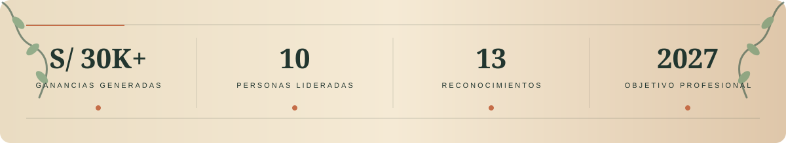
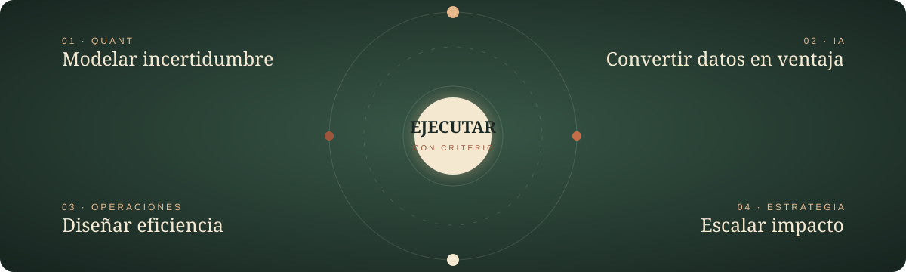
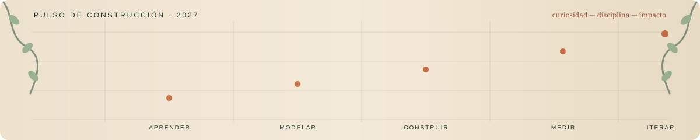
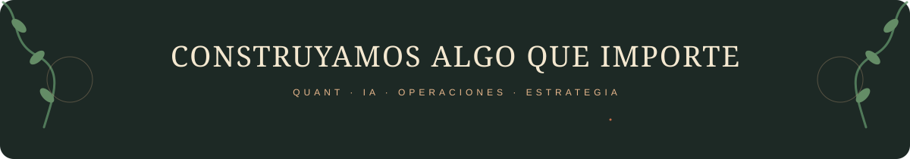

  

  

  
  
  
  
  
  
  

  
  
  

## 01 — PERFIL

<table align="center" width="100%">
  <tr>
    <td width="60%" valign="top">
      <h3>Datos → decisiones → ejecución</h3>
      
Estudiante de <b>Ingeniería Industrial</b> y emprendedor peruano enfocado en finanzas, IA y operaciones.

    </td>
    <td width="40%" valign="top">
      <h3>Objetivo</h3>
      
<b>Summer 2027</b> Quant · Tecnología · Estrategia

    </td>
  </tr>
</table>

  

## 02 — FOCO & TECH STACK

  

<b>⚙ Explorar Tech Stack</b>

 

<b>IA & AUTOMATIZACIÓN</b>

  
  
  
  

<b>DATOS & PROGRAMACIÓN</b>

  
  
  
  

<b>HERRAMIENTAS</b>

  
  
  
  

## 03 — IMPACTO & LIDERAZGO

<table align="center" width="100%">
  <tr>
    <td width="33%" valign="top"><h3>BonGallete</h3>
<b>Fundador & CEO</b> S/ 30K+ en ganancias · equipo de 10
</td>
    <td width="33%" valign="top"><h3>FOPI / OII</h3>
<b>Coordinador</b> Círculo fundador · 2024
</td>
    <td width="33%" valign="top"><h3>Man City Perú</h3>
<b>Vicepresidente Ejecutivo</b> Eventos · comunidad · comunicación
</td>
  </tr>
</table>

## 04 — RECONOCIMIENTOS

<table align="center" width="88%">
  <tr><th>Año</th><th>Distinción</th><th>Resultado</th></tr>
  <tr><td align="center"><b>2025</b></td><td>Harvard Youth Leadership Summit</td><td>Participación reconocida</td></tr>
  <tr><td align="center"><b>2025</b></td><td>Yale International Relations Essay Competition</td><td>Participante</td></tr>
  <tr><td align="center"><b>2024</b></td><td>The Wolves of Wall Street</td><td><b>Runner-up internacional</b></td></tr>
  <tr><td align="center"><b>2024</b></td><td>World Robot Olympiad Perú</td><td><b>4.º nacional</b></td></tr>
  <tr><td align="center"><b>2024</b></td><td>Coolest Projects</td><td><b>Mejor proyecto del Perú</b></td></tr>
  <tr><td align="center"><b>2023</b></td><td>Crea y Emprende</td><td><b>1.er puesto nacional</b></td></tr>
</table>

<b>🏆 Ver otros reconocimientos</b>

 

- **Representante hispano seleccionado** · International Youth Day 2024.
- **Recognition for Excellence** · Future Changemakers 2024.
- **Distinción Académica CADAL** · Universidad de Lima 2024.
- **Reconocimiento ministerial** · MINSA 2024.
- **4.º puesto nacional** · Feria Eureka 2023.
- **Top 3% mundial** · Make it Resilient and Green Future.

## 05 — FORMACIÓN

<table align="center" width="76%">
  <tr><th>Educación</th><th></th></tr>
  <tr><td><b>2024—2028</b></td><td><b>Ingeniería Industrial</b> Universidad de Lima</td></tr>
  <tr><td><b>2024—2025</b></td><td><b>Data Science for Privacy & Technology</b> Harvard SEAS</td></tr>
  <tr><th>Programas</th><th></th></tr>
  <tr><td><b>2026</b></td><td>Bloomberg Finance Fundamentals · Bloomberg</td></tr>
  <tr><td><b>2026</b></td><td>Automatización Eléctrica Industrial · Festo</td></tr>
  <tr><td><b>2025</b></td><td>Virtual Insights Series · Goldman Sachs</td></tr>
</table>

## 06 — ACTIVIDAD

  

<b>APRENDER → MODELAR → CONSTRUIR → MEDIR → ITERAR</b>

## 07 — INTERESES & CONTACTO

  

<b>Quant · IA · Minería · Robótica · Emprendimiento · Fútbol</b>

  
  

<i>«La estrategia solo importa cuando se convierte en ejecución.»</i>

