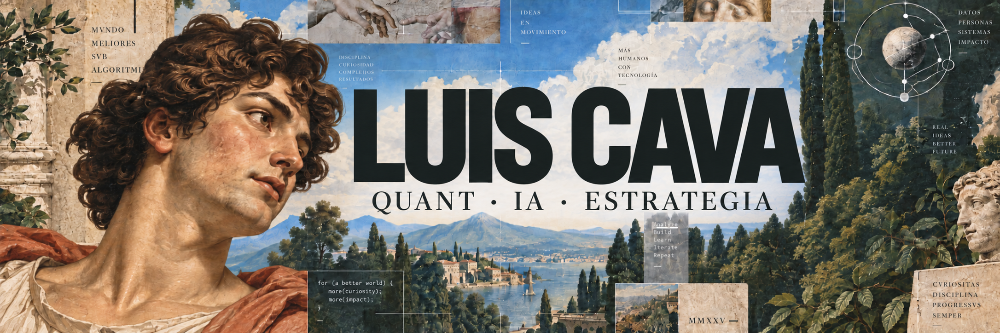

  

  

  
  
  
  
  
  

  
  
  

## 01 — PERFIL

<table>
  <tr>
    <td width="58%" valign="top">
      <h3>Datos → decisiones → ejecución</h3>
      
Soy estudiante de <b>Ingeniería Industrial en la Universidad de Lima</b> y emprendedor peruano. Me muevo entre mercados, tecnología, operaciones y negocios para convertir problemas complejos en decisiones claras y resultados medibles.

      
Mi ventaja está en combinar <b>curiosidad técnica</b>, <b>criterio estratégico</b> y una fuerte obsesión por construir.

    </td>
    <td width="42%" valign="top">
      <h3>Ahora</h3>
      
▸ Finanzas cuantitativas ▸ Trading algorítmico ▸ Inteligencia artificial ▸ Operaciones mineras ▸ Summer 2027

    </td>
  </tr>
</table>

  

## 02 — FOCO ACTUAL

  

<b>01 · Finanzas cuantitativas & mercados</b>

 
Modelos, riesgo, señales y decisiones bajo incertidumbre. Estoy desarrollando criterio técnico para entender no solo qué ocurre en un mercado, sino por qué y cómo medirlo.

<b>02 · Inteligencia artificial aplicada</b>

 
Exploro cómo usar IA para automatizar análisis, mejorar decisiones financieras y resolver problemas operativos con una lógica medible.

<b>03 · Operaciones & minería</b>

 
Me interesan la optimización de procesos, la eficiencia operativa y la innovación tecnológica aplicada a entornos industriales y mineros.

<b>04 · Estrategia & Summer 2027</b>

 
Busco prácticas para <b>Summer 2027</b> en finanzas, tecnología, operaciones o estrategia, donde pueda aportar capacidad analítica, energía emprendedora y ejecución.

<b>⚙ Abrir Tech Stack</b>

 

<b>IA & AUTOMATIZACIÓN</b>

  
  
  
  

<b>DATOS & PROGRAMACIÓN</b>

  
  
  
  

<b>HERRAMIENTAS</b>

  
  
  
  

## 03 — IMPACTO & LIDERAZGO

<table>
  <tr>
    <td width="33%" valign="top">
      <h3>BonGallete</h3>
      
<b>Fundador & CEO</b>

      
Producción, ventas y distribución. Más de <b>S/ 30,000 en ganancias</b> y liderazgo de hasta <b>10 personas</b>.

    </td>
    <td width="33%" valign="top">
      <h3>FOPI / OII</h3>
      
<b>Coordinación & círculo fundador</b>

      
Impulso al ecosistema olímpico de informática peruano y coordinación de la OII en 2024.

    </td>
    <td width="33%" valign="top">
      <h3>Man City Perú</h3>
      
<b>Vicepresidencia Ejecutiva</b>

      
Eventos, comunicaciones y desarrollo de una comunidad deportiva activa.

    </td>
  </tr>
</table>

<b>Ver mi principio de liderazgo</b>

 
Liderar es diseñar claridad: definir el objetivo, construir el sistema, medir el avance y crear las condiciones para que otras personas puedan ejecutar mejor.

## 04 — RECONOCIMIENTOS

| Año | Selección destacada | Resultado |
|:---:|---|---|
| **2025** | Virtual Harvard Youth Leadership Summit | Participación reconocida |
| **2025** | Yale International Relations Essay Competition | Certificate of Participation |
| **2024** | The Wolves of Wall Street | **Runner-up internacional** |
| **2024** | World Robot Olympiad Perú | **4.º puesto nacional** |
| **2024** | Coolest Projects | **Mejor Proyecto del Perú** |
| **2023** | Concurso Nacional Crea y Emprende | **1.er puesto Lima y nacional** |

<b>🏆 Explorar los 13 reconocimientos</b>

 

1. **Virtual Harvard Youth Leadership Summit (VHYLS)** — Recognition of Participation · Harvard University / HPAIR · mar. 2025.
2. **Yale International Relations Essay Competition** — Certificate of Participation · Yale International Relations Association / Learn with Leaders · mar. 2025.
3. **The Wolves of Wall Street** — Runner-up · Harvard Student Agencies / Learn with Leaders · oct. 2024.
4. **World Robot Olympiad Perú** — 4.º puesto nacional · sept. 2024.
5. **International Youth Day 2024** — Representante hispano seleccionado · Harvard University / Learn with Leaders · ago. 2024.
6. **Future Changemakers Program** — Recognition for Excellence · Harvard Student Agencies · jul. 2024.
7. **Coolest Projects 2024** — Mejor Proyecto del Perú y mención honorífica en Favorite Projects · Raspberry Pi Foundation · jun. 2024.
8. **OII / FOPI 2024** — Coordinador y miembro del círculo fundador · jun. 2024.
9. **Distinción Académica CADAL** — Universidad de Lima · may. 2024.
10. **Reconocimiento ministerial por contribución a la salud pública** — Publicidad y marketing · MINSA · mar. 2024.
11. **Concurso Nacional Crea y Emprende** — 1.er puesto en Lima y a nivel nacional · MINEDU · dic. 2023.
12. **Feria Nacional de Ciencia y Tecnología Eureka** — 4.º puesto nacional · MINEDU · nov. 2023.
13. **Make it Resilient and Green Future** — Top 3% mundial.

## 05 — FORMACIÓN

<table>
  <tr><td><b>2024—2028</b></td><td><b>Ingeniería Industrial</b> Universidad de Lima</td></tr>
  <tr><td><b>2024—2025</b></td><td><b>Data Science for Privacy and Technology</b> Harvard John A. Paulson School of Engineering and Applied Sciences</td></tr>
  <tr><td><b>2026</b></td><td><b>Bloomberg Finance Fundamentals</b> Bloomberg</td></tr>
  <tr><td><b>2026</b></td><td><b>Automatización Eléctrica Industrial</b> Festo</td></tr>
  <tr><td><b>2025</b></td><td><b>Virtual Insights Series</b> Goldman Sachs · participante seleccionado</td></tr>
</table>

## 06 — ACTIVIDAD & SISTEMA DE TRABAJO

  

<b>Mi ciclo de construcción</b>

 
<b>Aprender</b> para formular mejores preguntas → <b>modelar</b> para reducir incertidumbre → <b>construir</b> para probar → <b>medir</b> para decidir → <b>iterar</b> para mejorar.

  

## 07 — INTERESES & CONTACTO

  

  Finanzas cuantitativas · IA · operaciones mineras · robótica · emprendimiento · fútbol · conservación ambiental
   
  Español e inglés — competencia bilingüe o nativa

  
  

<i>«La estrategia solo importa cuando se convierte en ejecución.»</i>

