## 🕯️ SOBRE MÍ

Soy emprendedor peruano y estudiante de **Ingeniería Industrial en la Universidad de Lima**. Trabajo en la intersección entre datos, estrategia y ejecución: convertir problemas complejos en decisiones claras y resultados medibles.

- 📉 **Finanzas cuantitativas y trading algorítmico** — modelos, mercados y decisiones bajo incertidumbre.
- 🧠 **Inteligencia artificial** — tecnología aplicada a problemas reales.
- ⛏️ **Operaciones mineras** — optimización, innovación y eficiencia operativa.
- 🩸 **Emprendimiento** — fundé y escalé **BonGallete**: más de **S/ 30,000 en ganancias**, múltiples canales y un equipo de hasta **10 personas**.
- 🏦 Seleccionado para la **Goldman Sachs Virtual Insights Series 2025**.
- 🎯 Busco oportunidades de prácticas para **Summer 2027** en finanzas, tecnología, operaciones y estrategia.

## ⚙️ TECH STACK // HERRAMIENTAS

## 🏆 PREMIOS & LIDERAZGO

### Liderazgo

- 🩸 **Fundador & CEO de BonGallete** — producción, ventas, distribución, negociación y liderazgo de un equipo de hasta 10 personas.
- ⚽ **Vicepresidente Ejecutivo del Club Oficial de Aficionados del Manchester City FC en Perú** — eventos, comunicaciones y comunidad.
- 💻 **Coordinador de la OII y miembro del círculo fundador de FOPI 2024**.

### Reconocimientos destacados

- 🥇 **Concurso Nacional Crea y Emprende** — 1.er puesto en Lima y a nivel nacional.
- 🌑 **Make it Resilient and Green Future** — Top 3% mundial.
- 🏆 **Coolest Projects 2024** — Mejor Proyecto del Perú y mención honorífica en Favorite Projects.
- 🤖 **World Robot Olympiad 2024** — 4.º puesto nacional.
- 📈 **The Wolves of Wall Street** — Runner-up en competencia internacional de inversión.
- ⭐ **Future Changemakers Program** — Recognition for Excellence.

<b>🗝️ Abrir el archivo completo: 13 reconocimientos</b>

 

1. **Virtual Harvard Youth Leadership Summit (VHYLS) — Recognition of Participation**  
   Harvard University · HPAIR — marzo de 2025.
2. **Yale International Relations Essay Competition — Certificate of Participation**  
   Yale International Relations Association · Learn with Leaders — marzo de 2025.
3. **The Wolves of Wall Street — Runner Up**  
   Harvard Student Agencies · Learn with Leaders — octubre de 2024.
4. **World Robot Olympiad — 4th Place Nationally**  
   World Robot Olympiad Peru — septiembre de 2024.
5. **International Youth Day 2024 — Selected Hispanic Representative**  
   Harvard University · Learn with Leaders — agosto de 2024.
6. **Future Changemakers Program — Recognition for Excellence**  
   Harvard Student Agencies — julio de 2024.
7. **Coolest Projects 2024 — Best Project from Peru and Honorable Mention**  
   Raspberry Pi Foundation — junio de 2024.
8. **Coordinator of the OII and Founding Circle Member of FOPI 2024**  
   Federación Olímpica Peruana de Informática — junio de 2024.
9. **Distinción Académica — Círculo de Análisis y Diseño de Algoritmos (CADAL)**  
   Universidad de Lima — mayo de 2024.
10. **Reconocimiento Ministerial por contribución a la salud pública en publicidad y marketing**  
    Ministerio de Salud del Perú — marzo de 2024.
11. **Concurso Nacional Crea y Emprende — 1.er puesto en Lima y a nivel nacional**  
    Ministerio de Educación del Perú — diciembre de 2023.
12. **Feria Escolar Nacional de Ciencia y Tecnología Eureka — 4.º puesto nacional**  
    Ministerio de Educación del Perú — noviembre de 2023.
13. **Make it Resilient and Green Future — Top 3% mundial**.

## 🎓 EDUCACIÓN // CREDENCIALES

- **Ingeniería Industrial** — Universidad de Lima, 2024–2028.
- **Data Science for Privacy and Technology** — Harvard John A. Paulson School of Engineering and Applied Sciences, 2024–2025.
- **Bloomberg Finance Fundamentals** — Bloomberg, 2026.
- **Fundamentos de la Técnica para la Automatización Eléctrica Industrial** — Festo, 2026.

## 🎸 INTERESES

Mercados, robótica, innovación aplicada a operaciones, fútbol —especialmente el Manchester City—, emprendimiento y conservación ambiental.

## 📊 SEÑALES // ACTIVIDAD EN GITHUB

## 🌎 IDIOMAS

- **Español** — competencia bilingüe o nativa.
- **Inglés** — competencia bilingüe o nativa.

## 🦇 CONECTEMOS

Estoy abierto a colaborar en proyectos de Quant, IA, operaciones, minería, sostenibilidad y emprendimiento. Si estás construyendo algo ambicioso —o buscas un practicante con visión analítica para Summer 2027— conversemos.

### «La estrategia genera valor cuando sobrevive a la oscuridad y se convierte en ejecución.»

